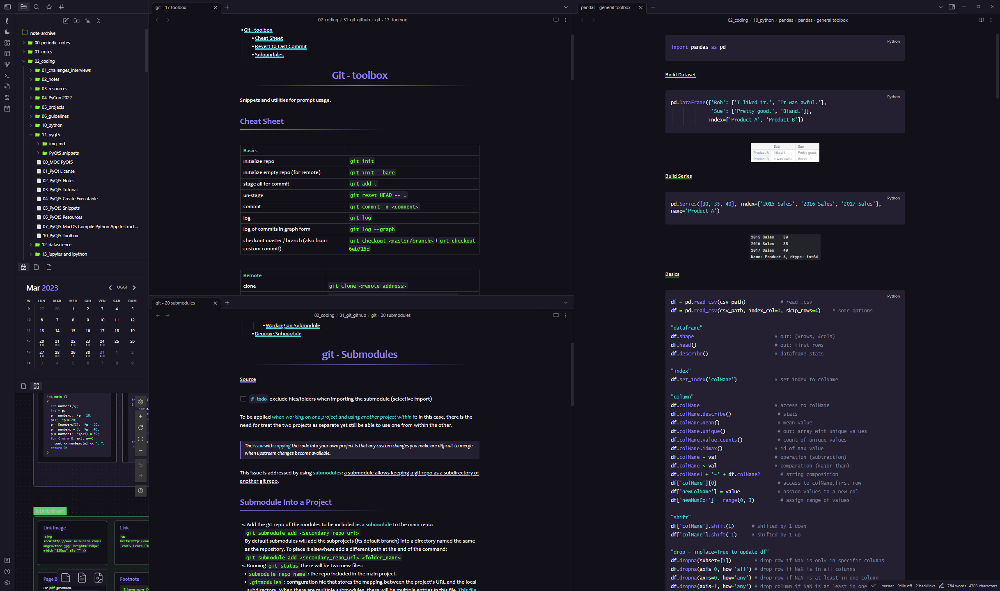
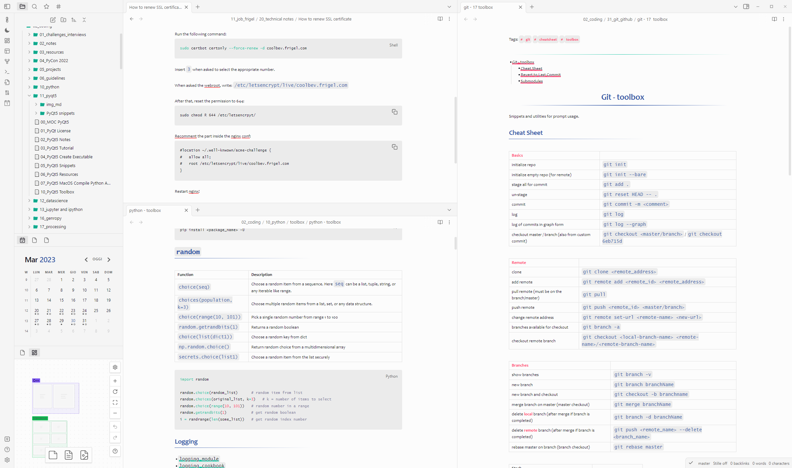

# Readme

`Sparkling Night` is a dark theme where colors sparkles in the night. 

Also light version is available, but colors sparkle a little less 😜

[GitHub Link](git@github.com:isax785/obsidian-sparkling-night.git)

 # Installation

To install the theme

- Open Obsidian Settings
- Go to `Appearance` and click `Manage`
- Under community themes search for "Sparling Night" and click `Use`

Enjoy!✨

