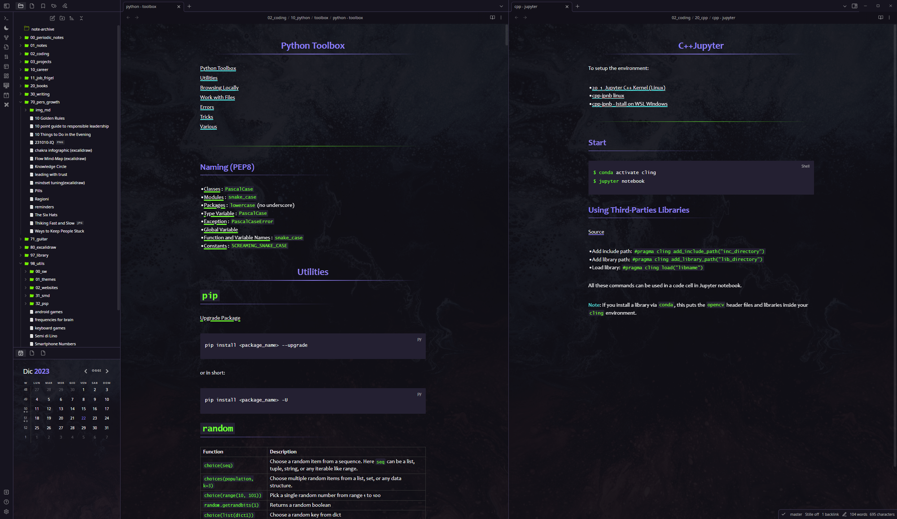

# Readme

`Sparkling Night` is a dark theme with colors sparkling in the night. 

## Sparkling Checkboxes

Sparkling colored checkboxes can be used to apply a distinction to the tasks (e.g. noticing the state of the task as shown below):

Syntax:

| Checkbox | Description |
|---|---|
|`- [>]` | working progress|
|`- [-]` | pause/stand-by|
|`- [/]` | stop |
|`- [<]` | to be scheduled |

# Installation

To install the theme

- Open Obsidian Settings
- Go to `Appearance` and click `Manage`
- Under community themes search for "Sparling Night" and click `Use`

Enjoy!✨

# What's New in 

## v.1.2.0

- removed light theme (it didn't make sense at all)
- widened line width
- `fix` tags internal spacing
- `fix` H1 header spacing
- `upgrade` new color for highlighted text
- `fix` search result text matchin now highligted

## v1.1.0

- `upgrade` colored checkboxes
- `fix` inline code text responsive size

---

[GitHub Link](git@github.com:isax785/obsidian-sparkling-night.git)